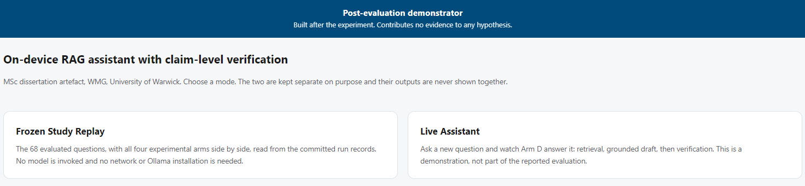
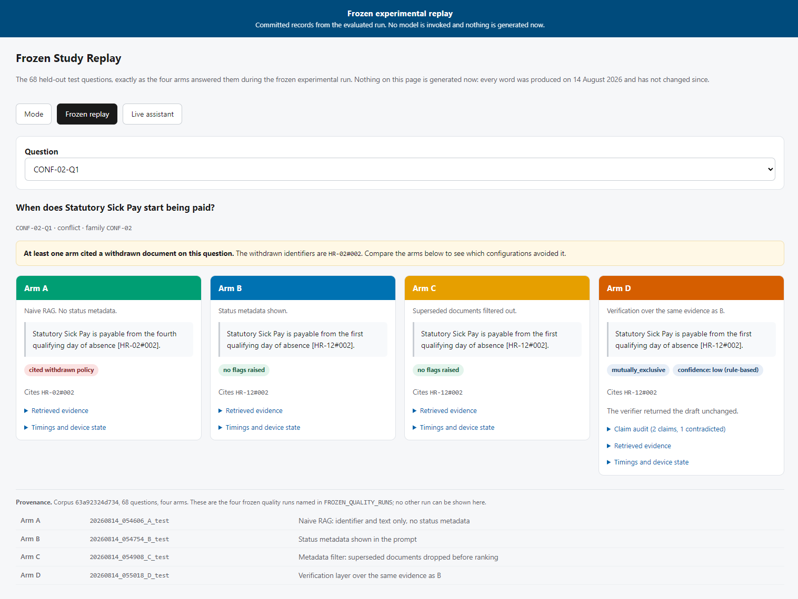
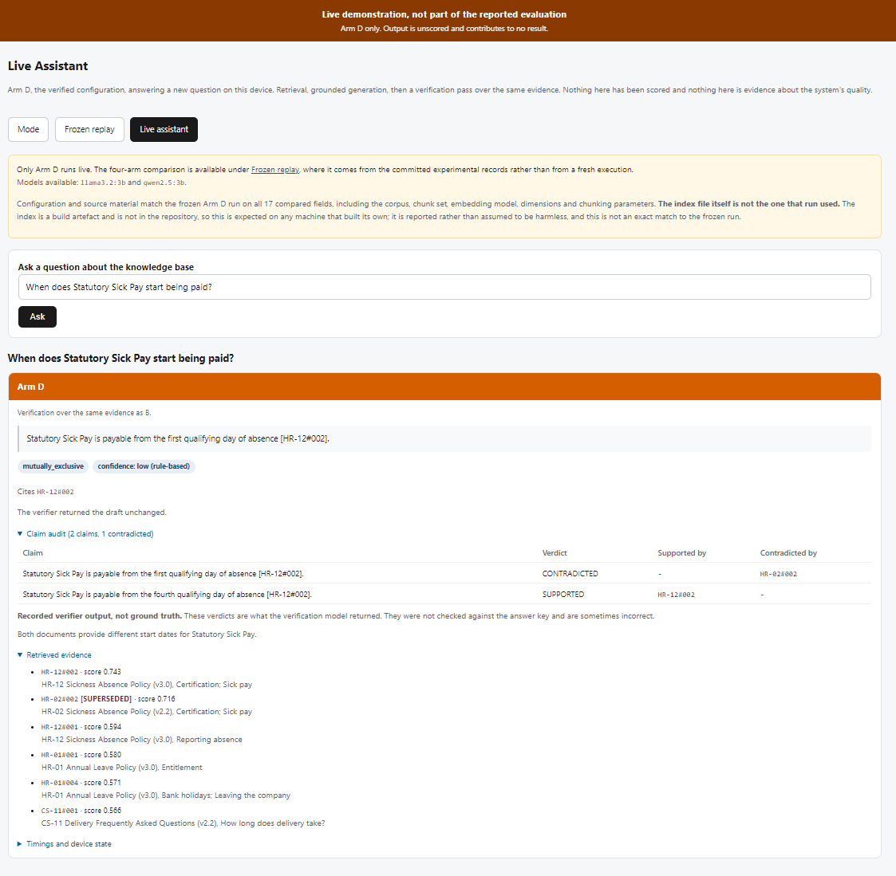
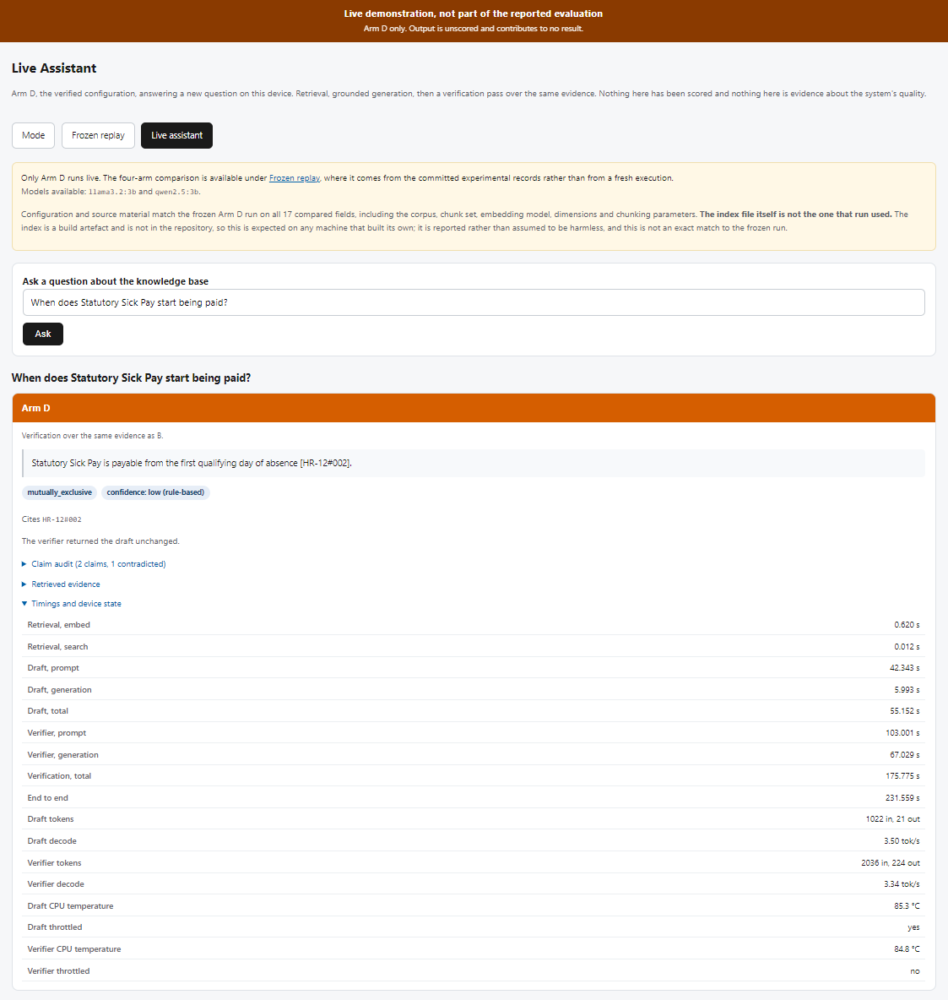

# Appendix C: The post-evaluation dashboard

A browser interface over the implemented components and the committed
experimental records. Built after the evaluation was complete and frozen,
governed by pre-registration amendment 1.27, and summarised in section 3.4.6.

**It contributed no evidence to any hypothesis.** Nothing shown in live mode has
been scored, and nothing shown in either mode is cited as a result. The
screenshots in this appendix illustrate an interface; they are not evidence
about the quality of the system.

## C.1 Running it

No dependency beyond what the artefact already needs. The dashboard is served by
Python's standard-library HTTP server, so there is no web framework to install
and nothing is fetched from the network at page load. This matters on the target
device: a demonstrator that needs a content delivery network to look right is a
demonstrator that fails in the room.

```bash
cd final_v1
python scripts/dashboard.py                 # http://127.0.0.1:8765
python scripts/dashboard.py --port 8080     # a different port
python scripts/dashboard.py --host 0.0.0.0  # reachable on the local network
```

It binds to localhost by default. The interface serves an organisation's
internal documents and has no authentication, and a demonstrator listening on
every interface would sit badly with the privacy argument the project makes.

On start-up it prints the readiness of each mode:

```
  Dashboard on http://127.0.0.1:8765
  Frozen replay : ready
  Live assistant: ready
  Ctrl-C to stop.
```

Frozen replay needs only the committed run records. Live assistant needs Ollama
running with `llama3.2:3b` and `qwen2.5:3b` pulled; where it is unavailable the
reason is printed here and shown on the page, and the question box is disabled
rather than accepting input it cannot serve.

## C.2 The two modes

| | Frozen Study Replay | Live Assistant |
|---|---|---|
| Source of answers | The four committed quality runs | Generated now, on this device |
| Arms shown | A, B, C and D side by side | D only |
| Questions | The 68 held-out test questions | Any question typed |
| Invokes a model | No | Yes |
| Needs Ollama | No | Yes |
| Banner | "Frozen experimental replay" | "Live demonstration, not part of the reported evaluation" |
| Scored | Yes, during the experiment | **Never** |
| Writes anything | Nothing. No write path exists | Nothing by default; anything future would go to `results/demo/` |

The modes are chosen from a selector on opening and are never shown together.
The four arms are never run live: a live four-arm comparison would produce
something indistinguishable in appearance from the reported experiment, and that
is the one confusion this design exists to prevent.

## C.3 What each panel shows

Each arm is a card, coloured as it is in the Chapter 4 figures so that an arm
looks the same on screen as it does in the results.

| Field | Meaning |
|---|---|
| Answer | The answer served to the user. For Arm D this is what the verifier returned, which is the draft unchanged whenever it had no complaint |
| Flags | Withdrawn policy cited, invented citation, citation identifier not retrieved, declined to answer, answer revised by the verifier, conflict relationship, and the confidence level |
| Cites | The chunk identifiers the answer cites |
| Draft before verification | Shown for Arm D only where the verifier changed the answer; otherwise the card states that the draft was returned unchanged |
| Claim audit | Each claim the verifier examined, its verdict of supported, contradicted or insufficient evidence, and the passages supporting it. Arm D only |
| Retrieved evidence | The six retrieved chunks with similarity score and document status. Superseded documents are marked in red |
| Timings and device state | Retrieval embed and search, generation, verification and end-to-end seconds; CPU temperature and throttle state **per stage**, where the platform reports them. A host that reports neither says so rather than showing "no" |
| Provenance | Six hashes agreeing across the four runs, the run directories, and the arm definition each was executed under |

Confidence is labelled **rule-based** wherever it appears, and a test asserts
that the word "calibrated" never does. Arms A, B and C show no confidence level
at all, because they have no verifier to produce one: that is an absence by
design rather than a missing value, and the interface distinguishes the two.

The claim audit shows both the supporting and the contradicting passages, and is
captioned as recorded verifier output rather than as an adjudication. On
`CONF-02-Q1` the verifier marks a correct claim contradicted and endorses a
withdrawn document's claim; an interface presenting that as a judgement would
mislead the person reading it. The audit collapses in the four-up replay grid,
where a three-column table made the Arm D card twice the height of the others,
and expands in the single-card live view.

## C.4 What replay refuses to show

Amendments 1.28 and 1.30.2. Replay joins four separate run directories into one
grid, and every property that makes that join meaningful is now checked rather
than displayed. It refuses, with a named error rather than a shorter table, when
a manifest declares a split other than `test`; when a run is marked
`performance` or `demonstration`; when a manifest names a different run than the
directory it sits in; when two of the named runs declare the same arm; when a
record's own `arm` field disagrees with its manifest; when a run answers the same
question twice; when the arms disagree on a question's text, category or family;
when the joined question count disagrees with the test-split size the manifests
declare; and when any of six provenance hashes disagrees across the runs or is
missing from one.

The last of these is the reason the appendix says six and not three. Amendment
1.28 enforced the corpus, chunk-set and configuration hashes and printed the
question set, conflict registry and index hashes beside them without comparing
them. A property that is displayed and not checked is not a guarantee, and it
gets quoted as though it were.

Live questions travel by POST. A question typed into a GET form ends up in the
URL, and from there in the browser history and in every proxy or server log
between the browser and this handler; a query about someone's sick pay or
disciplinary record does not belong in a log line. A GET to `/live` renders the
empty form, executes nothing and does not echo whatever it was given. Replay
stays on GET, because its parameter is a question identifier from a fixed public
list and a shareable link to a particular comparison is useful.

## C.5 A demonstration that shows the finding

`CONF-02-Q1`, "When does Statutory Sick Pay start being paid?", is the clearest
single screen in the study. The corpus contains HR-02, withdrawn, which says
payment begins on the fourth qualifying day, and HR-12, current, which says the
first. Replaying that question shows:

| Arm | Answer | Cited withdrawn policy | End to end |
|---|---|---|---:|
| A | fourth qualifying day, **wrong** | HR-02#002 | 4.78 s |
| B | first qualifying day | no | 1.29 s |
| C | first qualifying day | no | 0.75 s |
| D | first qualifying day | no | 7.65 s |

Arm A, with no status metadata, answers from the withdrawn policy. Arm C, a
three-line filter on document status, answers correctly in the shortest time of
the four. Arm D reaches the same answer as B and C and takes roughly ten times
as long as C to do it. That is the dissertation's central finding on one screen,
and it is the recommended question for a demonstration.

## C.6 Screenshots

Four captures of the running demonstrator. Screenshots 3 and 4 were taken on the
Raspberry Pi 5, which is the target device and the point of showing them.

**These are not figures.** They record one session on one machine, they cannot be
regenerated, and nothing in them was scored. They are distinguished from the
generated figures by the `shot_` prefix, and the test suite holds them to a
different standard for that reason.

### The mode selector



**Screenshot C.1** The opening screen. The two modes are chosen here and are
never shown together. The banner states that the demonstrator was built after
the experiment and contributes no evidence to any hypothesis; that sentence is
on every page.

### Frozen Study Replay



**Screenshot C.2** `CONF-02-Q1` in Frozen Study Replay, all four arms side by
side. No model is invoked: every word came from the committed records of 14
August 2026.

Arm A answers from the withdrawn policy and is flagged accordingly. Arms B, C
and D give the current figure. Arm D additionally reports a conflict
relationship and a rule-based confidence level, and states that the verifier
returned the draft unchanged. The provenance block beneath names the four run
directories and the corpus hash, so a reader can see which records produced the
row above.

### Live Assistant, claim audit



**Screenshot C.3** The same question asked live on the Raspberry Pi 5, with the
claim audit and the retrieved evidence expanded.

**The audit is unscored model output, not ground truth.** The verdicts shown are
what the verification model returned on this execution. They were not compared
with the answer key, they contributed to no metric, and the panel says so in the
interface rather than only here. On this execution the verifier marks the claim
carrying the current document's figure `CONTRADICTED` and the claim carrying the
withdrawn figure `SUPPORTED`, while returning the draft unchanged, so the served
answer is the current one.

Appendix D examines the verifier's classification on this question in the frozen
Arm D quality run. That is a different execution on a different machine, and its
recorded output differs from what is shown here. Neither corrects the other:
this screenshot is an unscored demonstration and the appendix reads the frozen
record, which is the only one any reported figure comes from.

The retrieved evidence list shows both sides of the disputed fact, with the
withdrawn chunk marked `[SUPERSEDED]` and its similarity score visible.

### Live Assistant, timings and device state



**Screenshot C.4** The timing and device panel for the same execution,
reported per stage.

**These are the figures for one question on one execution. They are not the
H5 estimate.** H5 is scored over the 68-question test split, where the Arm D
mean on the Pi 5 is 174.17 seconds against Arm B's 54.84, a ratio of 3.176. The
231.6 seconds shown here is a single demonstration and is not comparable with
those means; it is included to show what the panel reports, not to add a
measurement. Section 4.12 and Figures 4.3 and 4.4 carry the reported latency
evidence.

The throttle flags likewise describe **this execution only**. Thermal state on a
passively cooled board depends on what the device was doing beforehand, and one
capture establishes nothing about how often either stage throttles. Section 4.12
reports the throttling observed across the frozen runs.

### What the banner reports about the index

Screenshots C.3 and C.4 both carry a notice stating that configuration and
source material match the frozen Arm D run on all seventeen compared fields, and
that **the index file itself is not the one that run used**.

That is accurate and is reported rather than suppressed. `data/index.json` is a
build artefact and is not in the repository; every machine builds its own from
the committed corpus, so the Pi's index is its own build. Appendix E records both
hashes and what the two devices retrieved. The same page on the authoring
laptop, whose index is the file the frozen run used, reports it as identical
instead, so the check is visible in both directions rather than only when it
finds a difference.

Amendment 1.32.4 records why the notice is worded as it is. An earlier version
reported any differing index hash as a rebuild, which is a claim about how the
file came to differ that the code cannot support; it now reports that the recipe
agrees and the file is not the same file, and treats a differing corpus, chunk
set, embedding model, dimensions or chunking parameters as a mismatch rather
than a rebuild.
