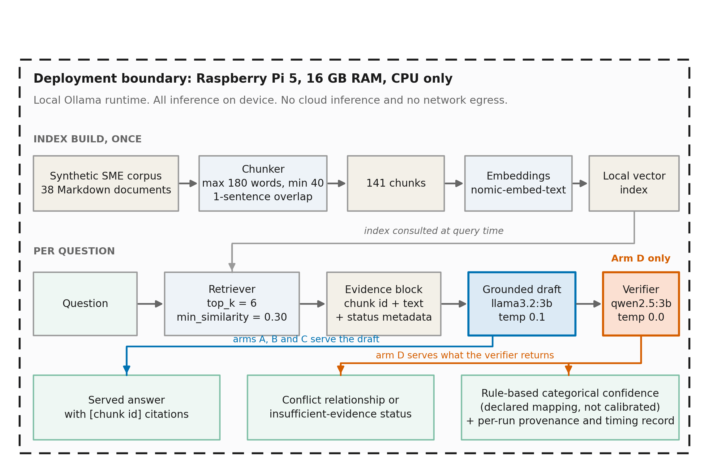
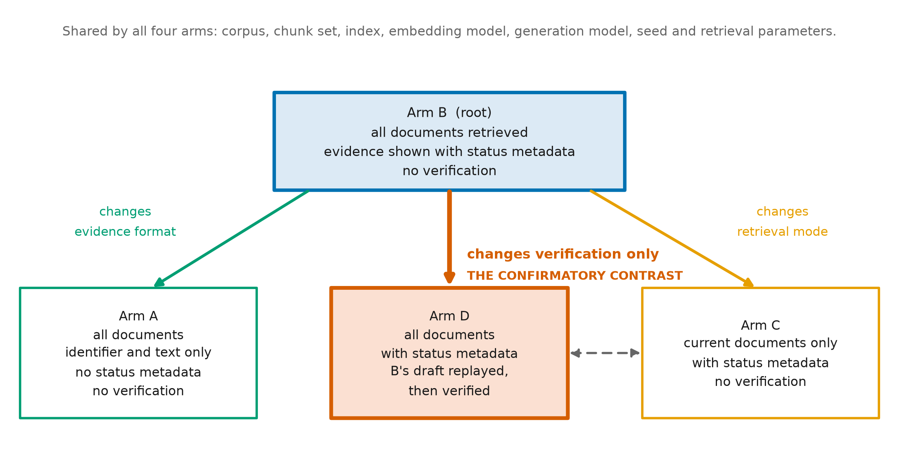

# Chapter 3: Methodology

> Working draft, 19 August 2026. This chapter replaces `Methodology_DRAFT.rtf`
> of 16 July, which described a design the experiment did not follow. It is
> written against `docs/PREREGISTRATION.md`, `config.json`, `docs/CORPUS.md` and
> the committed source. Corpus figures quoted here are reproduced by
> `scripts/kb_summary.py` rather than transcribed; the amendment appendix is
> emitted by `scripts/make_amendment_table.py`; Figures 3.1 and 3.2 are drawn by
> `scripts/make_architecture_figures.py`. Delete this note before transferring
> into the WMG template.

## 3.1 Introduction

This chapter sets out how the artefact was designed, how it was evaluated, and
what was done to make the evaluation resistant to the author's own preferences.
Section 3.2 states the research design. Section 3.3 gives the research questions
as they were tested and explains why they differ from those in Chapter 1's
earlier framing. Sections 3.4 to 3.6 describe the artefact, the knowledge base
and the four experimental arms. Section 3.7 sets out the evaluation design.
Section 3.8 describes the pre-registration, its decision rule and its amendment
record, which is the chapter's methodological core. Sections 3.9 and 3.10 cover
reproducibility and ethics.

## 3.2 Research design

The project follows Design Science Research, in which knowledge is produced
through the construction and rigorous evaluation of an artefact rather than
through observation alone (Hevner et al., 2004; Peffers et al., 2007). The
artefact is a retrieval-augmented assistant that runs entirely on local
hardware; the knowledge sought is whether an explicit verification layer earns
its place in such a system, and at what cost.

Design Science Research is vulnerable to a specific failure. The designer of an
artefact is also its evaluator, the space of defensible analyses is large, and
one of them will usually favour the design. Hevner et al. (2004) require
rigorous evaluation but do not prescribe a mechanism for constraining the
evaluator's discretion after results are in view. Pre-registration is the
established remedy in the empirical sciences, and its value lies precisely in
making the boundary between prediction and postdiction checkable rather than
asserted (Nosek et al., 2018). This project adopts it:
hypotheses, metrics, comparisons and decision thresholds were written down and
committed to version control before the confirmatory runs were executed, and
every subsequent departure carries a date and a reason. Section 3.8 describes
that apparatus. It is presented here as part of the research design rather than
as a procedural detail, because it is what allows the null results in Chapter 4
to be read as findings rather than as failures of implementation.

## 3.3 Research questions as tested

The umbrella research question is unchanged from Chapter 1: to what extent can
an on-device agentic RAG assistant, with source verification, support private
SME knowledge management and operational decision support within the resource
constraints of an edge device?

The four sub-questions below are the ones the experiment tests. They differ from
the four in the project's initial framework, and the reason is worth stating
plainly. The original sub-questions were written before the artefact existed and
assumed an evaluation built around a comparison of candidate generation models
and a calibration analysis of confidence flags. Development showed neither to be
the informative test. Retrieval calibration on the development split established
that no similarity threshold separates answerable from unanswerable questions in
this corpus (section 3.4.3), which moved abstention from the retrieval gate to
the verification layer. Development evidence also showed that the interesting
failure was not generation quality in the abstract but behaviour in the presence
of contradictory evidence. The sub-questions were therefore refined during
development and fixed in the pre-registration.

**They were not fixed before any data was seen.** Development and pilot evidence
had already informed them, and amendments 1.1 to 1.12 record design changes made
in the light of it. The boundary that matters is a later and narrower one: the
questions, hypotheses and decision rule were fixed **before the frozen
confirmatory test runs were executed**, and were not altered afterwards. Section
3.8.1 dates that boundary precisely.

> **RQ1.** Can a retrieval-augmented assistant running entirely on consumer and
> single-board hardware answer SME policy questions with verifiable citations?
>
> **RQ2.** Does an explicit verification layer improve the handling of
> contradictory evidence beyond what document metadata alone achieves?
>
> **RQ3.** Does the verification layer improve appropriate abstention on
> questions the corpus cannot answer?
>
> **RQ4.** What is the latency and thermal cost of the verification layer on a
> Raspberry Pi 5, and is it tolerable for the intended use?

RQ2 carries the contribution. RQ1 establishes that the baseline works at all,
RQ3 tests a second failure mode, and RQ4 establishes feasibility on the intended
deployment platform. RQ4 is stated over the Raspberry Pi 5 specifically, and is
scored only there, because the Pi is the target device and because prefill and
decode behaviour differ enough between it and a laptop that a laptop figure
would not answer the question asked. Laptop measurements are reported alongside
as descriptive context.

## 3.4 The artefact

### 3.4.1 Pipeline

The served pipeline has three stages. A question is embedded and matched against
a pre-built index of document chunks; the retrieved chunks are assembled into an
evidence block and passed to a generation model with instructions to answer only
from that evidence and to cite a chunk identifier after every statement; in the
verified configuration, the draft answer, the question and the same evidence are
passed to a second model which audits each claim, classifies any relationship
between the passages, and either returns the draft unchanged or replaces it.

An earlier design document described a six-stage pipeline including a separate
query-analysis stage, a separate claim-extraction agent and a next-action
suggestion stage. **None of the three was built.** The question goes straight to
retrieval, and the verifier audits claims itself rather than delegating
extraction. The evaluation reported in this dissertation covers the three stages
above and nothing else, and the word "agentic" in the title should be read as
referring to the verification and revision loop rather than to tool use or
planning. Figure 3.1 shows the pipeline as built, and shows nothing that was
not.

**Figure 3.1** The implemented on-device architecture, drawn inside its
deployment boundary. Everything shown runs on the Raspberry Pi 5 under a local
Ollama runtime; no request leaves the device at any point. The upper lane is the
one-off index build, the lower lane is what happens per question, and the
parameters shown are the frozen values in `config.json`. Arm D adds the
verification stage; arms A, B and C serve the draft directly. Confidence is shown as a
declared mapping rather than a calibrated score, for the reason given in section
3.4.5. Regenerated by `scripts/make_architecture_figures.py`.

### 3.4.2 Models and their selection

All arms generate with `llama3.2:3b` at temperature 0.1, a 4,096-token context
and a 400-token generation limit, with a fixed seed of 42. Embeddings use
`nomic-embed-text`. Inference runs through Ollama (Ollama, 2025) on the local
machine; no request leaves the device at any point.

The verifier is `qwen2.5:3b` at temperature 0.0 with a 700-token limit. It was
not chosen by preference. A separate diagnostic protocol, written before it was
run and recorded as amendment 1.10, compared the two candidates on conflict
detection over the development families. With the disputed passages isolated,
Qwen identified five of six families against Llama's two; on the six-chunk
window the deployed system actually retrieves, Qwen identified two of six
against Llama's none. Arm D is therefore a Llama answer audited by Qwen. The
protocol's own limits are recorded with the result: it establishes a ranking
between two models on one corpus, not that either model detects conflicts well.

### 3.4.3 Retrieval and its calibration

Documents are chunked at a maximum of 180 words with one sentence of overlap and
a 40-word minimum, producing 141 chunks from 38 documents. Retrieval returns the
six most similar chunks above a cosine similarity of 0.30.

Both parameters were calibrated on the development split alone, on 8 August,
before any test-split arm was run, and the calibration is reported as a result
rather than buried as a setting. Raising `top_k` from four to six lifted strict
recall from 0.667 to 0.815, conflict-pair recall on stricter-looser families
from 0.56 to 0.89, and on compatible families from 0.67 to 1.00, after which the
curve flattens. Lowering `min_similarity` from 0.32 to 0.30 requires more
explanation, because the honest description of that change is that the threshold
does no work. The answerable and unanswerable score distributions overlap
completely: all six development unanswerable questions scored above the lowest
answerable one. **No threshold separates them**, so 0.30 was set below every
observed score, and the system refuses nothing on similarity grounds. This is
recorded as a finding, not a failure to tune. It is also why abstention became
the verification layer's responsibility, and therefore why RQ3 and H4 are
stated over the verifier rather than over a retrieval gate.

### 3.4.4 The verification layer

The verifier receives the question, the draft answer and the same evidence block
the generator saw. It returns a structured object: a relationship classification
over the passages, a per-claim audit with a verdict of supported, contradicted or
insufficient evidence, an optional safe action, an escalation flag, and either a
replacement answer or null.

Two serving rules matter for interpreting Chapter 4. First, a verifier that
finds nothing is a no-op: the draft is served unchanged. This was not the
original behaviour. Amendment 1.6 records that Arm D had been rewriting answers
it had no complaint about, which would have made any Arm D result a measurement
of rewriting rather than of verification. Second, when every claim returns
insufficient evidence, the system serves a fixed abstention text written in the
source rather than model prose (amendment 1.7.6), so that no claim can be
smuggled into a refusal. That decision later defeated the blinding, which
section 3.7.4 and Chapter 4 both report.

Because Arm D replays Arm B's drafts, the difference between the two arms is the
verification pass alone, and the latency difference in RQ4 is attributable to it.

### 3.4.5 Confidence flagging: implemented, not evaluated

The system attaches a confidence level to each answer by a **rule-based
categorical mapping**: the verifier's verdict determines the level directly,
with supported claims and resolved conflicts mapping to medium, and contradicted
claims, insufficient evidence, invented evidence, parse failure and unresolved
conflict mapping to low. There is no scoring function, no threshold and no
fitted parameter; the mapping is a lookup declared in `config.json`. It is a
runtime policy and deliberately does not consult the answer key.

**Its calibration was not assessed, and no result in this dissertation depends
on it.** An earlier design specified a weighted confidence score with tuned
thresholds and an expected-calibration-error analysis (Guo et al., 2017); the
weights survive in the configuration file but appear nowhere in the source, and
no calibration analysis was ever run. The retrieval parameters described in
3.4.3 were calibrated on development data; **confidence was not**. The component
is reported here as implemented and unevaluated, it is excluded from the
contribution claimed in Chapter 1, and measuring it is proposed as further work
in Chapter 7. Describing an unmeasured mechanism as calibrated would be the
least defensible claim the dissertation could make.

### 3.4.6 Post-evaluation dashboard demonstrator

A browser-based dashboard provides a user-facing interface over the components
described above. Four properties define its status and are stated here so that
nothing later in the dissertation has to be read as a claim about it.

It was **developed after the experiment was complete and frozen**. It is **not
part of the four-arm evaluated pipeline** and does not appear in Figure 3.1,
which shows what was evaluated. It **contributed no evidence to H1 to H5**, none
of which is revisited in the light of anything it displays. What it provides is
an interface over the implemented components and the committed experimental
records, for demonstration and inspection.

It runs in two deliberately separated modes. **Frozen Study Replay** reads the
committed records of the four quality runs and shows all four arms answering the
same test question side by side; it invokes no model and runs on a machine with
no Ollama installed. **Live Assistant** runs Arm D alone on a newly typed
question, checking model availability before accepting one. The four arms are
never run live, because a live four-arm comparison would look exactly like the
reported experiment without being it. Each mode carries a banner naming what is
on screen, and their outputs are never combined in one view. The boundary is
enforced rather than intended: pre-registration amendment 1.27 fixes the rules,
and tests assert that a demonstration record cannot enter the quality analysis,
that the demonstrator holds no write path at all, and that a replay session
leaves every frozen file byte-identical.

Amendment 1.28 declared two further rules and amendment 1.30 found that neither
had been implemented, which is recorded here because the correction is part of
the method rather than an embarrassment to be tidied away. Replay now refuses to
render a comparison unless the four runs agree on six provenance hashes, declare
four distinct arms on the test split, and answer the same complete question set;
each refusal has a test that fails against the previous implementation. A live
question is accepted only by POST, so that a query about an individual's sick pay
or disciplinary record does not travel in a URL and from there into a browser
history or a proxy log. Appendix C describes the interface and its operation in
full.

## 3.5 The knowledge base

### 3.5.1 Composition and provenance

The corpus is a synthetic body of internal documentation for Northgate
Kitchenware Ltd, a fabricated wholesale distributor. It comprises 38 Markdown
documents totalling 11,374 words, averaging 299 words each, across eight
categories: human resources (8), operations (8), customer service (6), IT (5),
general (4), finance (3), product (2) and regulatory (2). Thirty-three documents
are current and five are marked superseded, 13.2 per cent of the corpus. Each
document carries front matter recording an identifier, version, effective date,
status and, where applicable, its supersession relationship.

Documents were authored directly as static Markdown rather than generated, so
that a reviewer can read exactly what the system was given. All identifiers use
ranges reserved for fiction: Ofcom's `01632 960` telephone range, the `.invalid`
domain reserved by RFC 2606, and an unallocated postcode area. An earlier
version used a company registration number in valid Companies House format,
which would have asserted facts about a real legal entity while claiming to be
fabricated; it was removed. Cross-references between documents are checked by
the loader rather than trusted, and figures quoted here are regenerated by
`scripts/kb_summary.py` rather than transcribed.

### 3.5.2 Planted conflicts

The corpus contains deliberate contradictions, and it is these that RQ2 is
stated over. They are typed, because a single "contradiction" category conflates
situations that demand different responses. Amendment 1.2 replaced one type with
four; amendments 1.4 and 1.5 reclassified families that had been typed by
intuition and typed wrongly, which is recorded because the initial confidence in
those judgements was itself part of the finding.

| Type | Situation | Correct behaviour | Reported families |
|---|---|---|---:|
| `version_supersession` | One document replaces another | Cite the current one; the superseded one is not authority | 4 |
| `mutually_exclusive` | Two current documents, no action satisfies both | Surface both, name neither as correct, escalate | 3 |
| `stricter_looser` | Two current documents, one stricter | Name the stricter course, which satisfies both | 5 |
| `compatible` | Two documents that appear to conflict but do not | Answer plainly, assert no conflict | 3 |

The `compatible` families are negative controls and exist to make over-detection
visible. Without them a verifier that announced a conflict between every pair of
documents would score well on every other measure. A further eight families are
marked as tuning and never appear in any reported result; the boundary is
enforced in code, so a question set that mixes them cannot be loaded.

### 3.5.3 Deliberate gaps

Several topics are absent by design, and adjacent enough to covered material to
be plausible: maternity and parental leave, redundancy and notice, share and
bonus schemes, flexible working, and staff purchase. A correct system declines;
an incorrect one invents policy. Five gap topics with two questions each form the
test-split basis for RQ3 and H4.

## 3.6 The four experimental arms

All four arms share the corpus, chunk set, index, embedding model, generation
model, seed and retrieval parameters. They differ as follows.

| Arm | Retrieval | Evidence shown | Verification | What it isolates |
|---|---|---|---|---|
| A | all documents | identifier and text only | none | Naive RAG, no status metadata |
| B | all documents | with status metadata | none | The value of exposing metadata |
| C | current only | with status metadata | none | The metadata-filter baseline |
| D | all documents | with status metadata | yes | The contribution |

**The arms form a tree rooted at B, not a ladder.** An earlier version of the
design claimed adjacent arms differed in one respect each; amendment 1.1.5
records that they do not. The single-variable contrasts are A against B for
evidence format, B against C for retrieval mode, and **B against D for
verification**, which is the confirmatory contrast for both H1 and H2. C against
D changes retrieval mode and verification together and is reported as the
practical comparison a practitioner would make, explicitly not as an ablation.

**Figure 3.2** The four arms as a tree rooted at Arm B. Each coloured edge
changes exactly one thing: evidence format for A, retrieval mode for C, and
verification for D. Only those three contrasts support an attribution. **B
against D is the pre-registered confirmatory contrast** for H1 and H2, and is
the only comparison that isolates the verification layer. The dashed connector
between C and D marks a comparison that changes two variables at once, retrieval
mode and verification, so no difference between them can be attributed to
either alone. It is reported because it is the choice a practitioner actually
faces, explicitly not as an ablation isolating verification. That caution is
made here rather than inside the figure, where it would duplicate this caption
and could not be held to anything. Regenerated by
`scripts/make_architecture_figures.py`.

Arm C deserves particular note because it is the arm that protects the honesty
of the result. A three-line filter on document status resolves every supersession
conflict with no reasoning at all. Reporting only A against D would credit the
verification layer with work that a metadata filter does for free. Arm C exists
to take that credit away, and Chapter 4 shows that it does.

## 3.7 Evaluation design

### 3.7.1 Question set and the development boundary

The question set contains 109 questions in 53 groups, split into 41 development
questions in 21 groups and 68 test questions in 32 groups. The test split
comprises 45 conflict questions across the 15 reported families at three
paraphrases each, 10 unanswerable questions across 5 gap topics, 8 factual, 3
synthesis and 2 partially answerable questions.

Every design decision, from prompt wording to similarity thresholds to verifier
output format, was tuned on the development split and the tuning families alone.
The boundary is enforced in code rather than by intention: the question-set
loader refuses a reported family in the development split and a tuning family in
the test split, so a contaminating set cannot be written or loaded. Two families
were excluded from all reported results because a Stage 4 pilot had contaminated
them, and are recorded rather than quietly dropped (amendment 1.1.1).

### 3.7.2 Unit of analysis

**The conflict family is the unit, not the question.** Three paraphrases of one
family are one observation. Both question-level and family-level figures are
reported, but every claim of difference is made at family level and the sample
size cited is the number of families. This is enforced by the question-set
validator and the aggregation code. It is a costly choice: it reduces the
effective sample from 68 to 32 groups and from 45 conflict questions to 15
families, and it is part of the reason no inferential test was pre-registered.
Treating
paraphrases as independent would have produced more comfortable numbers and less
defensible ones.

### 3.7.3 Metrics

Five primary metrics are pre-registered.

| Metric | Definition | Applies to |
|---|---|---|
| Conflict handling | Manual, blinded, three-point: 2 correct, 1 partial, 0 wrong | Conflict families |
| Superseded citation rate | Fraction of answers citing a withdrawn document as authority | Supersession families |
| False-conflict rate | Fraction asserting a contradiction where none exists | Compatible controls |
| Appropriate abstention | Fraction of unanswerable questions declined rather than answered | Gap topics |
| Answer correctness | Manual, blinded, three-point, against required and forbidden claims | Factual, partial, synthesis |

Secondary metrics are automatic: citation validity, citation support, citation
completeness, hallucinated citation rate, end-to-end latency, peak CPU
temperature and throttle state.

The primary conflict metric is manual and blinded by deliberate choice.
Automatic scoring cannot judge whether an answer adequately discloses a
disagreement, and a model-based judge would import the failure modes under
investigation (Es et al., 2024). Citation support is measured automatically by
checking whether a cited passage contains the claim's quantities; this is a
necessary condition and not a sufficient one, making it a lower bound on
citation error and therefore an upper bound on true support, as Chapter 4
reports.

### 3.7.4 Manual scoring and blinding

All 272 answers, four arms by 68 questions, were pooled, shuffled under a fixed
seed, stripped of arm labels and replaced with opaque codes, with the key written
to a separate file that the scoring tool refuses to open until scoring is
complete. One reviewer, the author, scored them.

Three properties of that procedure are reported rather than assumed.

**Reliability was measured.** Because Arm D replays Arm B's drafts, 58 groups of
byte-identical answers appear in the shuffled sheet, at separations of up to 250
items, and were scored independently. The rubric score agreed in all 58.
Deduplicating would have saved roughly a third of the work and produced agreement
by construction, which measures nothing.

**The blinding failed and is reported as partial.** Thirteen items carry the
fixed abstention text of section 3.4.4 verbatim, a string only the verified arm
can produce. Recognising it once attaches an opaque code to that arm, and that
code identifies all 68 of its items. The sheet was not rebuilt, because item
numbers are positions in a shuffled file that recorded judgements already key on,
and because on those thirteen items the judgement is precisely whether declining
was right, so redaction would leave nothing to score. A per-item self-report flag
was added to measure unblinding rather than assume it. It was raised on none of
the 266 items where it was offered, and that is explicitly not reported as
evidence that blinding held.

**One field proved unreliable and was re-collected.** The abstention flag drifted
monotonically with position through the first pass. A second pass collecting that
field alone, in a separately seeded order, was run under a rule fixed in advance:
the second pass is the reported value, its agreement with the first is the
reliability figure, and neither log is edited in the light of the other. The two
agree on 253 of 272 items, a raw rate of 0.930. Because the field is heavily
imbalanced, with 191 agreed negatives, raw agreement flatters it: a reviewer
marking nothing at all would score 0.702. A chance-corrected coefficient is
therefore reported alongside it, and Cohen's kappa is 0.820 (Cohen, 1960).
Re-ordering was the point: a re-pass in the original order would have
drifted at the same positions and certified a reliability the instrument does not
have.

### 3.7.5 Hardware conditions and their separation

Three conditions were measured: the development laptop with GPU offload (Ryzen 7
7840HS, RTX 4050), the same laptop restricted to CPU, and a Raspberry Pi 5 with
16GB of memory, CPU only. Hardware conditions are named rather than lettered
because an earlier lettering collided with the experimental arms, making "condition
B" ambiguous.

The quality experiment and the hardware experiment are separate executions and
the separation is enforced. Performance runs accept only arms B and D, are marked
`purpose: performance` in their manifests, write to a different index file, and
never call the scoring code, so no quality figure exists in their records to be
picked up later. The four frozen quality runs are named in a closed list, and a
run created afterwards cannot enter the quality analysis whatever it is called.
Before any timing figure is computed, the analyser independently re-checks 47
properties of the runs, including that Arm D replayed Arm B's drafts; any failure
refuses the report.

## 3.8 Pre-registration and analysis plan

### 3.8.1 What was fixed, and when

`docs/PREREGISTRATION.md` was registered on 8 August 2026 and states the research
questions, the arms, five hypotheses, the metrics, the unit of analysis, the
comparison procedure, the decision threshold, the stopping rules, and a section
listing what would make the study wrong. It was written before the verification
layer existed and before any question set had been run.

It was then amended twenty-six times. The dates matter, and the chronology below
is taken from the commit history rather than asserted.

| Phase | When | What could still change |
|---|---|---|
| A. Development | 8 August to 14 August 06:45, ending at the verifier freeze `5064c3b` | The design. Amendments 1.1 to 1.12 changed the conflict taxonomy, the arms, retrieval parameters, the serving rule and the verifier, in the light of development and pilot evidence. |
| **Frozen confirmatory runs** | **14 August 07:13, `4ba79da`** | **Nothing. One execution, four arms, no tuning.** |
| B. Scoring | 14 to 15 August, to `ed65f22` | How the existing answers are scored. Amendments 1.13 and 1.14, both before the blinding key was opened. |
| C. Hardware | 15 August, to `d4e9a90` | The separate timing experiment only. Amendments 1.15 to 1.24 could not touch the quality result, which was signed off at `be55077`. |
| D. Write-up | 19 August | Reporting of already-frozen data. Amendments 1.25 and 1.26. |

The claim this chapter makes is therefore narrow and checkable: the hypotheses,
the confirmatory contrast and the decision rule were fixed before the runs at
`4ba79da` and were not altered afterwards. Amendments after that point govern
scoring and analysis of data already collected, and each states what it did not
change.

### 3.8.2 The decision rule

**No inferential test was pre-registered or computed. The analysis applies the
prespecified paired-effect and direction criteria.** A difference is reported as
**supported** only when both of the following hold: the paired mean difference
exceeds 0.25 on the three-point scale, and the direction holds in at least three
of the four supersession families for H1 or six of the eight pooled families for
H2. A difference meeting one criterion but not the other is **suggestive**. A
difference meeting neither is **not supported**, and the pre-registration states
explicitly that this includes cases where the point estimate favours the
contribution.

Differences are paired within family before averaging, so the comparison asks
whether an arm beat another on the same material rather than comparing two
means. No confidence interval is computed anywhere in the study, so no arm is
ever described as equivalent to another; H1's second leg is reported as an
operational comparison against a stated margin, not as an equivalence test. Five
hypotheses are tested and no multiplicity correction is applied, because no
p-values exist to correct; the number is stated so a reader can discount
accordingly.

### 3.8.3 Stopping rules

Four rules exist so that a decision to stop or continue cannot be made on the
basis of a result. The question set is frozen once validated. Runs are repeated
only for a recorded technical fault, with the discarded run retained. The
verifier is not modified after conflict-family results are seen. Manual scoring
completes before the key is opened. A fifth rule is a commitment rather than a
constraint: **if H2 is not supported, the dissertation reports that the
verification layer did not improve on the metadata baseline and analyses why.**
That was written in advance precisely because it is the outcome under most
pressure to be reframed, and Chapter 4 reports it.

### 3.8.4 The amendment record

Appendix B tabulates all 36 amendments across 224 numbered entries. Six
groups shaped the study most and are summarised here.

**The taxonomy was wrong twice (1.2, 1.4, 1.5).** A single contradiction type
became four, three negative-control families were added, and four families that
had been typed by intuition were then found to be typed wrongly. Amendment 1.4
records not only the correction but the condition that allowed it, and 1.5
merged two hypotheses into one pooled H2 because the subtype judgement had
proved too unreliable to condition a threshold on. The lesson carried into the
analysis: the confirmatory claim rests on the distinction that held, whether two
live documents disagree, and the finer sort is reported descriptively.

**Retrieval calibration produced a negative finding (1.3).** Described in 3.4.3.
The threshold that was supposed to gate refusal does not separate the classes,
and this is reported rather than tuned around.

**The verifier was rewriting answers it had no complaint about (1.6).** Caught
in a pilot, before any test arm ran. Without the fix, every Arm D figure in
Chapter 4 would measure rewriting rather than verification.

**A reproducibility claim was made and withdrawn (1.7).** The verifier was
briefly declared non-reproducible on the strength of a measurement that turned
out to be measuring the instrument. The correction, the corrected instrument and
its decision rule are all recorded, along with a trap that would have read as
reproducibility had it not been anticipated.

**The blinding was defeated and the scoring instrument drifted (1.13, 1.14).**
Described in 3.7.4. Both were found by the author, after scoring, and reported
rather than repaired into invisibility.

**The demonstrator was corrected against its own amendment (1.27, 1.28).**
1.27 fixed the boundary for the post-evaluation dashboard before it was built,
and 1.28 records that one of its rules described a write path the code does not
have. The implementation was the safer of the two and was kept; the amendment
was corrected, because a rule describing something the code does not do does not
become acceptable by pointing in the safe direction.

**Two pre-registered metrics had never been aggregated (1.25, 1.26).** Answer
correctness and superseded citation rate were scored and frozen but no code ever
summed them, and a reliability statistic quoted in working notes existed in no
file. Both were corrected at write-up under rules fixed before the figures were
computed. Amendment 1.26.6 further records seven reporting defects found by
independent review of the results chapter, including a provenance claim about
the figure-generation code that the code did not meet.

That last group is included deliberately. An amendment record that contains only
improvements is not a record of anything.

## 3.9 Reproducibility and provenance

Every run writes a manifest recording SHA-256 hashes of the corpus, chunk set,
question set, registry, configuration and index, together with host details, the
Ollama version, a model-store fingerprint and the observed placement of each
model. The analysis re-checks these before computing anything and refuses a set
of runs whose provenance does not agree. A model store reachable over a tunnel
to the wrong machine was detected once by this mechanism, which is why it exists.

Generation is seeded at 42 with temperature 0.1 and verification at temperature
0.0. The repository carries an automated test suite covering the chunker,
retriever, generator, verifier, question-set boundary, scoring tools, analysis
rules and the hardware boundary, including tests that assert the failure modes
above cannot recur, and tests that pin the wording of reported claims so that a
withdrawn overstatement cannot return unnoticed. The count is deliberately not
quoted here: it rises with every correction, so a number written into prose is
stale by the next commit and invites a reader to check a figure that measures
nothing in particular. `pytest -q` at the commit under examination reports it.

Two different standards apply to how results reach Chapter 4, and the difference
is stated rather than glossed. **The figures are generated**: every value they
plot is read from committed analysis outputs by `scripts/make_figures.py`, which
computes no statistic of its own and contains no typed-in number. **The Markdown
tables are transcribed by hand** from those same outputs and checked against
them programmatically. Transcription is a step a reader must take on trust, so
`results/analysis/hypotheses.json` governs on any discrepancy between a table
and its source.

## 3.10 Ethical considerations

The project proceeds under the approved ethics submission and its waiver
conditions: no human participants, no primary data collection, and no real
business or personal data. The knowledge base is entirely synthetic, describes a
fictional organisation, and uses identifier ranges reserved for fiction, as
described in 3.5.1. All computation is local to the project's own devices, so no
data is transferred to any third-party service, which is consistent with the
privacy argument the project itself makes and with the data minimisation
principle of the General Data Protection Regulation (Regulation (EU) 2016/679).
Code, results and drafts are held in a private repository and on university
storage. Required ethics training evidence is included in the appendices.

## 3.11 Summary

This chapter set out a Design Science Research study whose evaluation is
constrained by a pre-registered analysis plan. It described the three-stage
artefact, the models and the evidence for the verifier's selection, the synthetic
corpus and its planted conflicts, and the four arms whose contrasts isolate
evidence format, retrieval mode and verification. It set out an evaluation whose
unit is the conflict family, whose primary metrics are manually scored under
partial blinding with measured reliability, and whose decision rule was fixed
before the confirmatory runs were executed. It stated where the blinding failed,
where an instrument drifted, and where the design changed under development
evidence, with dates. The next chapter reports what the evaluation measured.
