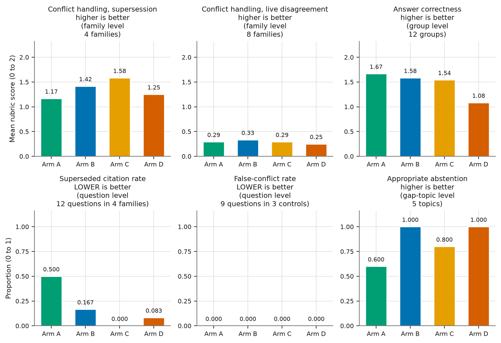
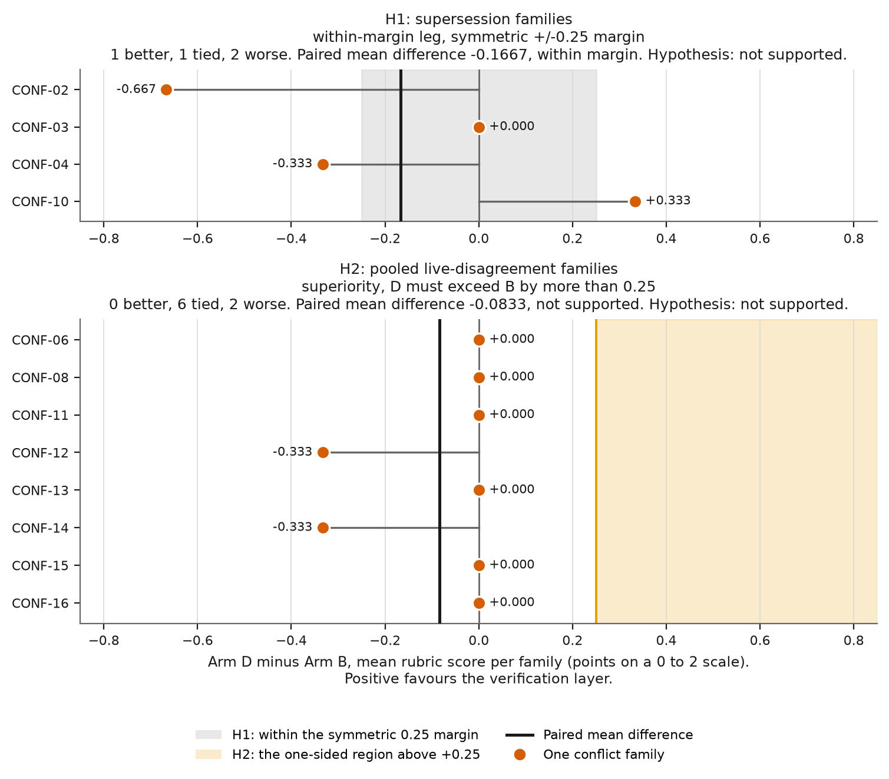
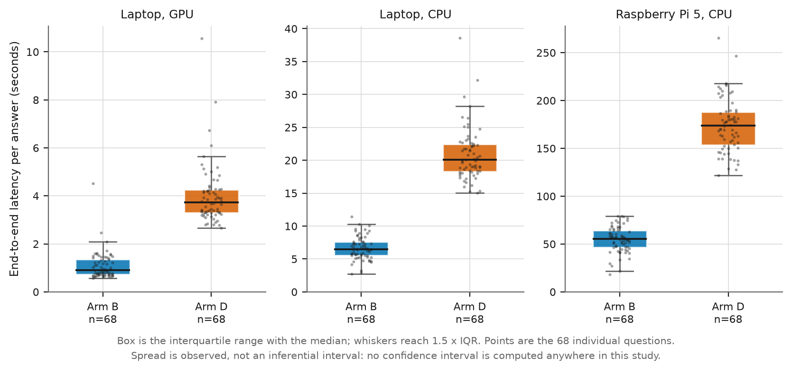
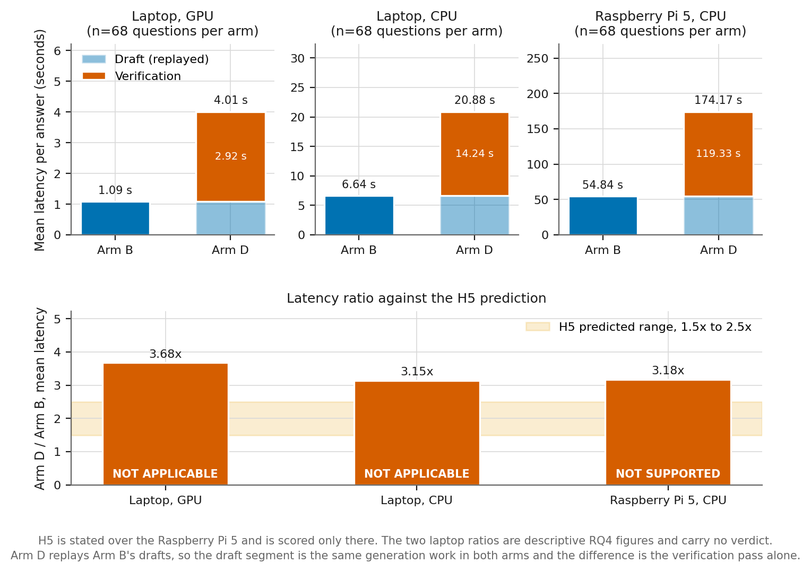

# Chapter 4: Results

> Working draft, 19 August 2026. Written against `docs/PREREGISTRATION.md` and
> the committed analysis outputs, not against the 16 July methodology draft,
> which describes an earlier design. Chapter 3 is to be reconciled with the
> experiment as executed before Chapter 5 is written. Every figure is generated
> by `scripts/make_figures.py`. The tables below are written by hand from the
> committed analysis outputs and checked against them; they are not generated.
> Delete this note before transferring into the WMG template.

## 4.1 Introduction

This chapter reports what the evaluation measured. It is organised by
hypothesis, in the order the hypotheses were registered, so each result can be
read against the prediction and the decision rule fixed before any arm was run.
Section 4.2 states the evaluation as executed. Section 4.3 establishes how far
the measurements can be trusted, before any verdict is given. Section 4.4 gives
the whole comparison in one view, and sections 4.5 to 4.10 take the hypotheses
in turn. Section 4.11 reports the remaining primary metric, which carries no
hypothesis, and section 4.13 adds a clearly labelled exploratory diagnostic. Analysis of why these results occurred is held for Chapter 5;
comparison with the literature, implications for deployment and the study's
limitations are held for Chapter 6.

## 4.2 The evaluation as executed

Four arms were run over a single frozen corpus of 38 documents and 141 chunks,
sharing the index, the embedding model, the generation model, the seed and the
retrieval parameters. Arm A is naive retrieval-augmented generation, showing
identifiers and text only. Arm B adds document status metadata to the evidence
block. Arm C filters superseded documents out before ranking. Arm D adds the
verification layer to the same evidence Arm B sees, and replays Arm B's drafts
so that the difference between them is the verification pass alone.

The arms form a tree rooted at B rather than a ladder. B against D is therefore
the single-variable contrast that isolates verification and is the confirmatory
contrast for H1 and H2; C against D changes retrieval mode and verification
together and is reported as a practical comparison, not as an ablation.

The reported sample is the held-out test split: 68 questions in 32 groups per
arm, comprising 45 conflict questions across 15 families, 10 unanswerable
questions across 5 deliberate gap topics, 8 factual, 3 synthesis and 2 partial
questions. The unit of analysis is the family or group, not the question. Every
claim of difference is made at that level and the sample size cited is the
number of families. All four quality runs used `llama3.2:3b` for generation,
with `qwen2.5:3b` as the verifier in Arm D. Timing was measured separately, in
performance-only executions that compute no quality metric at all.

## 4.3 Measurement quality and analysis integrity

The primary conflict and correctness metrics are manual, applied by one
reviewer. Their reliability was measured rather than assumed, and the
limitations below apply to every manual figure in this chapter.

**Table 4.1** Measurement quality of the manual metrics. All figures are
regenerated into the `measurement_quality` block of
`results/analysis/hypotheses.json`; no threshold or verdict attaches to any of
them.

| Property | Value | What it means |
|---|---|---|
| Rubric score agreement | **58 / 58 groups** | Byte-identical answers scored independently and blind, at separations of up to 250 items in a shuffled sheet. No score divergences at all. |
| Consistency on all reported values | 57 / 58 groups | The one divergence, CONF-04-Q2, is on `asserts_conflict` only, not on the score. |
| Abstention, raw agreement | **0.930** (253 / 272) | Two passes over the same items in separately seeded orders. |
| Abstention, Cohen's κ | **0.820** | Chance-corrected. Expected agreement is 0.612 because 191 of 272 items are agreed negatives, so raw agreement flatters this field. |
| Abstention 2 x 2 | 62 both, 9 first only, 10 second only, 191 neither | Reported so κ can be recomputed by hand. |
| First-pass drift | 10 items | Confined to positions 227 to 271 of the first pass and scattered in the re-pass order. The second pass is the reported value throughout. |
| Blinding | **partial, self-monitored** | 13 items carry the abstention template verbatim, a string only the verified arm produces. Recognising it once exposes all 68 of that arm's items. |
| Self-reported unblinding | 0 of 266 | **Not** evidence the blinding held: those 13 items were identifiable on sight regardless. |
| Reviewers | 1 | No inter-rater agreement. The figures above are intra-rater. |

Two constraints apply throughout. **No inferential test was pre-registered or
computed. The analysis applies the prespecified paired-effect and direction
criteria.** A difference is supported only when the paired
mean difference exceeds 0.25 on the three-point scale **and** the direction
holds in 3 of 4 supersession families or 6 of 8 live-disagreement families;
meeting one criterion alone is suggestive, and meeting neither is not supported,
including where the point estimate favours the contribution. No confidence
interval is computed anywhere in this study, so no arm is described as
equivalent to another and no figure in this chapter carries an inferential error
bar. Where spread is shown it is the observed distribution, labelled as such.

## 4.4 Results in overview

**Figure 4.1** The five primary metrics of pre-registration section 4, by arm.
Conflict handling is one metric, but the hypotheses partition its families into
supersession and live disagreement and score them separately, so it is shown on
both sets; the other four panels are the remaining four metrics. Rubric metrics
(top row) are the manual three-point scale, 0 wrong to 2 correct. Rate metrics
(bottom row) are proportions from 0 to 1. **The level of aggregation is not the
same throughout and is stated on every panel:** rubric metrics are means over
family or group means, superseded citation rate and false-conflict rate are per
question, and appropriate abstention is per gap topic. Direction of merit is
also stated on every panel. Answer correctness and superseded citation rate
carry no hypothesis and no verdict (amendment 1.25). Colours are the Okabe-Ito
set and every bar is directly labelled, so identity is never carried by colour
alone.

**Arm D, the contribution, did not lead any primary metric outright.** On
appropriate abstention it tied Arm B, both reaching the ceiling of 5 of 5 gap
topics. On false-conflict rate every arm tied at zero, so no arm led and none
could. On the remaining three it was behind: weakest of the four on answer
correctness and on conflict handling under live disagreement, and second from
last on supersession, where the metadata-filter arm scored highest.

The sections below take each prediction in turn against its pre-registered
decision rule. Why these results occurred is examined in Chapter 5; comparison
with the literature, implications for SME deployment and the study's limitations
are held for Chapter 6.

## 4.5 H1: supersession conflicts

H1 predicted A < B ~ C ~ D on the four `version_supersession` families, on the
reasoning that a status marker alone should resolve them and that the
verification layer should add nothing.

**Table 4.2** Conflict handling on the supersession families. Manual three-point
rubric, 4 families and 12 questions per arm.

| Arm | Mean | Paired difference against A | Direction |
|---|---:|---:|---:|
| A | 1.1667 | - | - |
| B | 1.4167 | +0.2500 | 2 / 4 |
| C | 1.5833 | +0.4167 | 2 / 4 |
| D | 1.2500 | +0.0833 | 1 / 4 |

Both legs fail. On the superiority leg, B exceeds A by exactly 0.250, which does
not exceed the 0.25 threshold, and the direction holds in 2 of 4 families
against the 3 required. C meets the effect criterion but not the direction
criterion and is recorded as suggestive. On the within-margin leg, C and B sit
within the margin and so do D and B, but D and C differ by 0.3333 in C's favour
with C higher in 3 of 4 families. That contrast changes retrieval mode and
verification together, so the difference cannot be attributed to either alone;
the confound limits attribution rather than erasing the observation. The
per-family D minus B differences appear in the upper panel of Figure 4.2.

The superseded citation rate measures the same four families directly. It is a
pre-registered primary metric carrying no hypothesis and, under amendment 1.25,
is reported without a verdict.

**Table 4.3** Answers citing a withdrawn document as authority. 4 supersession
families, 12 questions per arm. Lower is better.

| Arm | Answers | Rate | Families with any |
|---|---:|---:|---:|
| A | 6 / 12 | 0.500 | 2 / 4 |
| B | 2 / 12 | 0.167 | 2 / 4 |
| C | **0 / 12** | **0.000** | **0 / 4** |
| D | 1 / 12 | 0.083 | 1 / 4 |

Therefore, H1 was not supported, on both legs.

## 4.6 H2: live policy disagreements

H2 is the confirmatory hypothesis and the quantitative case for the
contribution. It predicted A ~ B ~ C < D on the eight families where two current
documents disagree, three `mutually_exclusive` and five `stricter_looser`
pooled, on the reasoning that neither a status filter nor a status marker can
help when both documents are in force.

**Table 4.4** Conflict handling on the pooled live-disagreement families. Manual
three-point rubric, 8 families and 24 questions per arm. D against B is the
pre-registered confirmatory contrast.

| Arm | Mean | Contrast with D | Paired difference | Direction |
|---|---:|---|---:|---:|
| A | 0.2917 | D vs A | -0.0417 | 0 / 8 |
| B | 0.3333 | **D vs B** | **-0.0833** | **0 / 8** |
| C | 0.2917 | D vs C | -0.0417 | 0 / 8 |
| D | 0.2500 | | | |

**Figure 4.2** Per-family paired differences, Arm D minus Arm B, for H1 (4
families) and H2 (8 families), in points on the 0 to 2 rubric scale. Each dot is
one conflict family, which is the unit of analysis, and the vertical rule is the
paired mean difference. **The two panels are judged by different rules and are
drawn accordingly.** H1's second leg asks whether the arms sit within a
symmetric margin of 0.25 in either direction, shown as the grey band. H2
predicts that D exceeds B by more than 0.25, a one-sided criterion, shown as the
shaded region to the right of +0.25. No family in either panel reaches the H2
region.

The confirmatory contrast fails on both criteria. D exceeds B on none of the
eight families: it ties on six and is worse on two, CONF-12 and CONF-14, so the
direction count is 0 of 8 against the 6 of 8 required. The aggregate therefore
runs against the prediction, though it does so through two families rather than
through a reversal on all eight. Leaving out any one family in
turn leaves the paired difference negative in every fold, with a spread of
0.0476, so the estimate is stable and no single family drives it. That stability
is not evidence for the null: with eight families the study cannot rule out a
small true effect in either direction.

The pooled result hides a split between the subtypes, which keep separate
rubrics because they demand different behaviour. On the five `stricter_looser`
families the arms score 0.4667, 0.5333, 0.4667 and 0.4000 for A, B, C and D. On
the three `mutually_exclusive` families, where no single action satisfies both
documents, **every arm scored zero on every family**. No configuration tested
handled a mutual exclusion correctly even once, so the pooled contrast rests
entirely on the stricter-looser material.

Therefore, H2 was not supported.

## 4.7 H2c: over-detection on the negative controls

H2c was stated as a directional prediction against the contribution: that on the
three `compatible` families, which are negative controls, Arm D would assert
conflicts where none exist more often than Arm B. The pre-registration states
that a null result here would be a genuinely strong finding.

**Table 4.5** False conflicts asserted on the compatible control families
CONF-07, CONF-09 and CONF-17. 3 families and 9 questions per arm. A table rather
than a chart, because every cell is zero and a chart of zeroes shows nothing.

| Arm | Questions with a false conflict | Families with any | Rate |
|---|---:|---:|---:|
| A | 0 / 9 | 0 / 3 | 0.000 |
| B | 0 / 9 | 0 / 3 | 0.000 |
| C | 0 / 9 | 0 / 3 | 0.000 |
| D | 0 / 9 | 0 / 3 | 0.000 |

**No false conflicts were observed for Arm D or Arm B in this control sample**,
nor for Arm A or Arm C. The prediction therefore fails in the direction that
favours the system. What is recorded is an observation about these controls, not
a general finding that the verification layer does not over-detect.

The limitation is attached rather than appended. Zero events across 3 families
and 9 questions per arm is a floor rather than a measurement: **a denominator
this small cannot rule out moderate over-detection**, because an over-detection
rate well above zero could still have produced no events here. The CONF-04-Q2 divergence noted in section 4.3
lies outside this denominator, CONF-04 being a supersession family.

Therefore, H2c was not supported, and the failure of this prediction is a
favourable result for the system rather than an adverse one.

## 4.8 H3: citation validity overstates citation quality

H3 predicted that in every arm citation support would fall below citation
validity. Figures follow the convention established before unsealing:
restricted to claim-making answers, since an abstention cites nothing by design,
with the group as the unit of inference.

Two properties of these metrics govern how the table is read. **Validity is
answer-level and all-or-nothing.** It comes from
`GroundedAnswer.has_valid_citation_ids`, so an answer counts as valid only when
every identifier it cites is real and retrieved; it is not the proportion of
individual identifiers that are sound. **The three metrics have different group
denominators**, because a group enters a metric only where that metric is
defined. Validity is defined for every claim-making answer, whereas support is
defined only where the answer cited something checkable, so the denominators are
not interchangeable and the columns below are not directly comparable across
metrics.

**Table 4.6** Citation metrics at group level, claim-making answers only. The
group count for each metric is its own denominator and is stated beside it.

| Arm | Validity | (groups) | Support | (groups) | Completeness | (groups) | Claim-making answers |
|---|---:|---:|---:|---:|---:|---:|---:|
| A | 0.8333 | 32 | 0.6667 | 15 | 0.7176 | 18 | 68 |
| B | 0.8177 | 32 | 0.6766 | 14 | 0.6748 | 17 | 68 |
| C | 0.8333 | 32 | 0.4561 | **19** | 0.6404 | 21 | 68 |
| D | 0.7989 | **29** | 0.6528 | **12** | 0.6875 | 14 | 55 |

Support falls below validity in all four arms, which is the comparison H3
states, and the direction holds under the labelled common-eligibility
sensitivity analysis as well. The size of the gap should not be compared across
arms: C's support rests on 19 groups and D's on 12, so they are computed over
different questions. Arm D's denominators are the smallest throughout because
thirteen of its answers were abstentions, and its validity covers 29 groups
rather than 32 because it abstained on three groups entirely.

The automatic support measure checks whether a cited passage contains the
claim's quantities. That is a necessary condition and not a sufficient one: a
citation may contain the right figure and still be the wrong source, and purely
qualitative claims have no quantities to check. The measure is therefore a
lower bound on citation **error**, which makes the reported support figure an
**upper bound** on true support. The consequence runs in H3's favour: true
support can only be lower than the table shows, so the true gap between validity
and support is at least as large as reported. Section 4 of the pre-registration
records this property in shorthand as "citation support is a lower bound", which
is the looser phrasing; the precise statement is the one in
`evaluation/answer_scoring.py`, and it is the one used here.

Therefore, H3 was supported.

## 4.9 H4: abstention on the deliberate gaps

H4 predicted that Arm D would abstain appropriately more often than A, B and C,
on the reasoning that a structured `INSUFFICIENT_EVIDENCE` verdict is either
present or absent whereas the baseline can only express refusal in free text.
The unit is the gap topic abstained on throughout, and the `abstained` field is
the second pass described in section 4.3.

**Table 4.7** Appropriate abstention on the 5 deliberate gap topics, 10
questions per arm.

| Arm | Questions | Gap topics abstained on throughout |
|---|---:|---:|
| A | 8 / 10 | 3 / 5 |
| B | 10 / 10 | **5 / 5** |
| C | 9 / 10 | 4 / 5 |
| D | 10 / 10 | **5 / 5** |

D exceeds A and C and ties B, both at the ceiling of 5 of 5 topics. H4 as stated
requires D to exceed all three. The margin over A and C is real and is reported,
but it cannot be separated from the ceiling: with five topics there was no room
for D to exceed a baseline that abstained on every one.

Therefore, H4 was not supported.

## 4.10 H5: the latency cost of verification

H5 predicted that on the Raspberry Pi 5 the verified arm would take between 1.5
and 2.5 times as long as the unverified baseline, on the reasoning that one
verification pass over a short prompt should cost less than a full second
answer. Only the `pi5_cpu` condition carries an H5 verdict; the laptop
conditions are descriptive RQ4 figures.

**Table 4.8** Mean end-to-end latency per answer, 68 questions per arm per
condition, in seconds.

| Condition | Arm B | Arm D | of which verification | D / B |
|---|---:|---:|---:|---:|
| Laptop, GPU | 1.09 | 4.01 | 2.92 | 3.68 |
| Laptop, CPU | 6.64 | 20.88 | 14.24 | 3.15 |
| **Pi 5, CPU** | **54.84** | **174.17** | **119.33** | **3.18** |

**Figure 4.3** Distribution of end-to-end latency per answer, Arm B against Arm
D, on all three hardware conditions. Each panel has its own axis in seconds; a
shared axis would compress the GPU condition into the baseline. Boxes are the
interquartile range with the median, whiskers reach 1.5 times the IQR, and every
one of the 68 questions per arm is plotted. The spread is the observed
distribution, not an inferential interval.

**Figure 4.4** Mean latency and its composition (top), and the D to B ratio
against the H5 prediction (bottom), n = 68 questions per arm per condition. Arm
D replays Arm B's drafts, so the draft segment is identical generation work in
both arms and the difference is the verification pass alone. The shaded band is
the pre-registered 1.5 to 2.5 range. All three ratios sit above it.

The **observed** ratio on the Pi 5 is 3.18, under the throttled conditions
documented below, and exceeds the upper bound of the predicted range. The ratio is stable across three platforms whose decode rates differ more
than twenty-fold, from 77.2 tokens per second on the laptop GPU to 3.28 on the
Pi. That is consistent with an overhead which is structural rather than a
property of the target device, although three conditions cannot establish it.
The workload is the proximate explanation: over the Pi run the verifier prompt
averaged 1,934 tokens against the draft's 900, and the verifier generated 179
output tokens against the draft's 46, under a `num_predict` of 700 against 400.

Thermal behaviour was recorded rather than assumed. The Pi reported itself
throttled on 64 of 68 draft questions and on all 68 verifier questions, at mean
CPU temperatures of 87.1 and 88.2 degrees Celsius and a maximum of 90.3. The
absolute latencies are therefore those of a throttled machine. Both arms ran
under throttling, and the verifier stage ran under it slightly more often and
slightly hotter than the draft stage, so it cannot be assumed that throttling
affected the two equally or that the ratio is unaffected by it. The unthrottled
ratio was not measured.

Therefore, H5 was not supported. Whether a mean of 174 seconds per answer is
tolerable for the intended use, which is the second half of RQ4, is a judgement
rather than a measurement, and is made in Chapter 5. What follows from it for an
SME considering deployment is drawn out in Chapter 6.

## 4.11 Answer correctness

Answer correctness is the second pre-registered primary metric carrying no
hypothesis, scored on the same three-point rubric against each question's
required and forbidden claims. It applies to the 13 questions in 12 groups that
ask for a direct answer or an answer flagging a gap. No threshold is applied.

**Table 4.9** Answer correctness on the questions containing no conflict. Manual
three-point rubric, 13 questions in 12 groups per arm.

| Arm | Question level | Group level |
|---|---:|---:|
| A | 1.6154 | **1.6667** |
| B | 1.5385 | 1.5833 |
| C | 1.4615 | 1.5417 |
| D | 1.0769 | **1.0833** |

Arm D is the weakest of the four. The shortfall is located rather than
characterised here: D scored zero on `FACT-account-hold`, `FACT-forklift-preuse`
and `FACT-written-warning-duration`, and on each it declined to answer a
question that A, B and C answered correctly. A fourth loss, on
`SYN-faulty-warranty-return`, is shared with B and C. No refusal rate over
answerable questions is computed, because section 4 of the pre-registration
defines abstention over the gaps only and a metric over the complement would be
one invented after the data.

## 4.13 Exploratory: what the verifier concluded internally

**This section is exploratory and post-hoc.** The pattern was noticed while
checking a screenshot of the demonstrator, provisional figures were produced,
and only then was the rule fixed and recorded as amendment 1.29. It carries none
of the weight of sections 4.5 to 4.11, no threshold is applied, no verdict is
reached and no chance baseline is computed. It is reported because a reader of
two null results is entitled to ask what the verification layer was doing
instead.

The verifier records a `relationship` for the retrieved passages, chosen from
six categories, without ever seeing the registry's declared type. The two
vocabularies are mapped by `DECLARED_TO_INFERRED`, which predates this analysis.
**Two measures are kept separate and are never combined:** whether any conflict
relationship was reported at all, and whether the reported relationship matched
the mapped declared type.

**Table 4.11** The verifier's internal relationship classification against the
registry, frozen Arm D quality run, all 45 test questions
belonging to a registered family. Descriptive only.

| Declared type | Questions | Any conflict reported | Exactly classified | Families exact on a majority |
|---|---:|---:|---:|---:|
| Version supersession | 12 | 8 | 4 | 1 / 4 |
| Mutually exclusive | 9 | 1 | 1 | 0 / 3 |
| Stricter-looser | 15 | 6 | 1 | 0 / 5 |
| Compatible controls | 9 | 5 | 0 | 0 / 3 |
| **All registered families** | **45** | **20** | **6** | **1 / 15** |

On the 36 questions drawn from families that carry a genuine conflict, the
verifier reported some conflict relationship on 15 and named the declared type
on 6. One family of the fifteen was exactly classified on a majority of its
three paraphrases. **The category `contextually_compatible` was never returned
once in the entire run**, which is the category the three compatible controls
call for.

A verifier shown only one side of a disputed fact has nothing to classify, so
the figures are repeated below restricted to the questions where the chunks
carrying both sides of the focal fact were retrieved. That restriction uses
`anchor_chunks` and `pair_is_present` from the existing retrieval and protocol
code; the weaker test of whether both document identifiers appeared is not used,
because it admits exactly the case the restriction exists to exclude.

**Table 4.12** Restricted to the 33 questions where both sides of
the focal disputed fact were retrieved.

| Declared type | Questions | Any conflict reported | Exactly classified |
|---|---:|---:|---:|
| Version supersession | 12 | 8 | 4 |
| Mutually exclusive | 6 | 0 | 0 |
| Stricter-looser | 8 | 4 | 0 |
| Compatible controls | 7 | 4 | 0 |
| **Total** | **33** | **16** | **4** |

The full confusion matrix of declared type against reported relationship is in
Appendix D.

**These figures do not revise H2c, and they are not in tension with it.** H2c is
scored on `asserts_conflict`, the reviewer's judgement of what the **served
answer** says, and records no false conflicts on the controls in any arm. The
figures above read the verifier's **internal** relationship field, where a
conflict relationship was reported on 5 of the
9 control questions. The two measure different
outputs: the internal conclusion did not become an assertion in the answer
served. Both are correct and neither replaces the other.

`CONF-02-Q1` is offered in Appendix D as one illustrative frozen case rather
than as evidence in itself. What these figures support, and no more, is examined
in Chapter 5.

## 4.12 Summary

**Table 4.10** Hypothesis verdicts under the pre-registered decision rule of
section 5.

| | Prediction | Verdict |
|---|---|---|
| H1 | A < B ~ C ~ D on 4 supersession families | not supported |
| H2 | A ~ B ~ C < D on 8 live-disagreement families | not supported |
| H2c | D over-detects on 3 compatible controls | not supported |
| H3 | citation support < validity in every arm | **supported** |
| H4 | D abstains more than A, B and C on 5 gap topics | not supported |
| H5 | latency(D) is 1.5x to 2.5x latency(B) on the Pi 5 | not supported |

**Across H1 to H5, only H3 was supported; the additional adverse H2c prediction
was not supported. H3 concerns a cross-arm citation property rather than an
effect of verification.** The confirmatory contrast for the contribution, D
against B on the live-disagreement families, favoured D on none of the eight:
six ties and two families where D was worse. The layer's measured cost is a
factor of 3.18 in mean end-to-end latency on the target device, under the
throttled conditions recorded in section 4.10.

This chapter reports what was measured and the verdict each pre-registered rule
produced. Chapter 5 analyses why these results occurred, by research question.
Chapter 6 sets them against the literature and draws out the implications and
limitations.

---

**Sources and provenance.** The underlying figures are produced from the frozen
runs by committed code: `scripts/analyse_results.py`,
`scripts/analyse_performance.py` and `scripts/make_figures.py`. Two different
standards apply to how they reach this chapter, and the difference is stated
rather than glossed.

The four **figures** are generated. `make_figures.py` reads its values from
`hypotheses.json` and the three performance reports; group-level means come from
the `family_level` and `group_level` fields the analysis writes rather than from
an average taken at plot time; sample sizes are read from the arm blocks and the
H5 range is parsed from the hypothesis statement, failing loudly if it stops
matching. No value is typed into the figure script.

The **tables** are Markdown and are typed by hand from those same outputs. They
are verified against source, but transcription is a step a reader has to take on
trust, so any discrepancy between a table here and
`results/analysis/hypotheses.json` should be resolved in favour of the latter.

Hypothesis decisions, levels, contrasts, sensitivity analyses, the two primary
metrics of sections 4.5 and 4.11 and the measurement-quality block of Table 4.1:
`results/analysis/hypotheses.json`. Latency, token rates and thermal state:
`results/analysis/performance_latest_test_performance_{laptop_gpu,laptop_cpu,pi5_cpu}.json`;
prompt and output token counts and the per-question distributions of Figure 4.3:
the corresponding run records, read through the validated loader in
`analyse_performance`. Scoring reliability, cross-checked against Table 4.1:
`results/manual/consistency.json`, `results/manual/abstention_agreement.json`
and `results/manual/drift_report.json`. Hypotheses, metric definitions and the
decision rule: `docs/PREREGISTRATION.md` sections 3 to 5; the limitations of
section 4.3 in amendments 1.13, 1.14 and 1.16; the two primary metrics in
amendment 1.25; Cohen's κ and the figure-generation rules in amendment 1.26.
